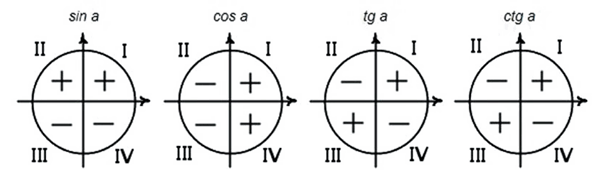
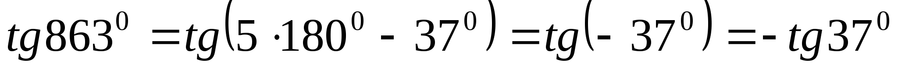

# Вопрос 10

### Знаки значений тригонометрических функций. Четность и нечетность тригонометрических функций. Период тригонометрических функций. Примеры.

- Знаки тригонометрических функции можно посмотреть на рисунке

    

- Четность функций:
    * Синус - нечетный
    * Косинус - четный
    * Тангенс - нечетный
    * Котангенс - нечетный

    > Четность функций можно доказать благодаря тригонометрической окружности.

- Период функций
    * Синус - 2п
    * Косинус - 2п
    * Тангенс - п
    * Котангенс - п

    > Период находится благодаря тригонометрической окружности.

#### Примеры.

- На период функции
    - Вычислить tg(765):
        - Мы знаем период tg - п
        - След. Мы можем отсечь 2 периода функции - 2п - 720 градусов
        - У нас останется 45 градусов, а это табличное значение
        - Ответ: 1

    

- Примеры на четность функции.
    - ***cos (–13π)*** = cos (13π) = cos (12π + π) = -1
    - ***sin (–721⁰)*** = -sin (721⁰) = -sin (720⁰ + 1⁰) = -sin(1⁰)

- Пример для знаков триг. функций:
    - Определить знак tg(263)
        - 263 градуса - угол 3 четверти
        - В 3 четверти тангенс - положительный
        - След. знак - плюс

    - Определить знак sin(675)
        - 675 - угол 4 четверти
        - Синус в 4 четверти - отрицателен 
        - След. знак минус