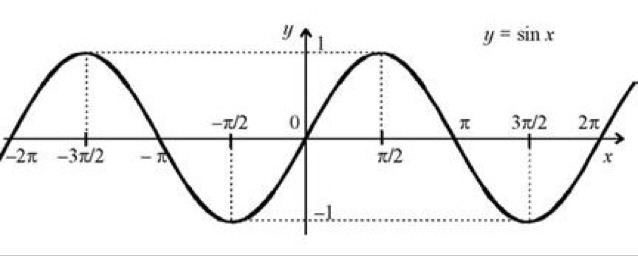

# Вопрос 11

## Функция y = sin(x). Её график и свойства

- ***sin(x)*** - Отношение противолежащего катета к гипотенузе.

    

> Функция y = sin(x) определена на всей числовой прямой, является нечётной и периодической с периодом 2π

*** 

> Кривая, являющаяся графиком функции y = sinx, называется ***синусоидой***.
- Свойства графика синус.
    * Область определения — множество *R* всех действительных чисел. 
    * Множество значений — отрезок [−1 ; 1].
    * Период - 2п
    * Нечётная
    * Принимает значение:
        * значение, равное 0, при  x = πn, n ∈ Z;
        * наибольшее значение, равное 1, при x = π/2 + 2πn, n ∈ Z;
        * наибольшее значение, равное -1, при x = -π/2 + 2πn, n ∈ Z;
    * ***y > 0***: (0 + 2πn; π + 2πn)
    * ***y < 0***: (π + 2πn ; 2π + 2πn)
    * ***Возрастает:***
        * [−π/2 + 2πn ; π/2 + 2πn]
    * ***Убывает:***
        * [π/2 + 2πn ; 3π/2 + 2πn]
