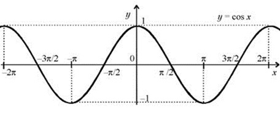
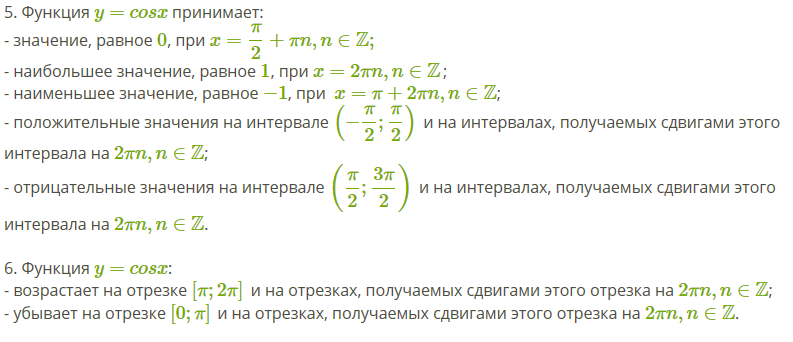

# Вопрос 12

## График y = cos(x). Её график и свойства

- cos(x) - отношение прилежащего катета к гипотенузе

- Функция y = cosx является чётной. Поэтому её график симметричен относительно оси OY.

    

- Свойства косинуса: 
    * Область определения — множество *R* всех действительных чисел. 
    * Множество значений — отрезок [−1 ; 1]. 
    * Период - 2п
    * Чётная функция
    

