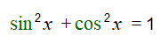
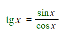
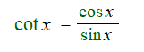
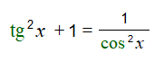
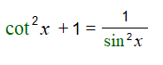

# Вопрос 15

### Основные соотношения между тригонометрическими функциями одного и того же аргумента

- Всего 6 основных формул(соотношений) тригонометрических функций одного аргумента
    * Основное тригоноиетрическое тождество

        

    * Из определения тангенса и котангенса можно сделать вывод, что:
        * Тангенс:

            

        * Котангенс:

            

    * Если перемножить тангенс и котангенс:

        

    * Выражать тангенс или котангенс через О.т.т.:

        

        

