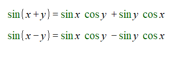
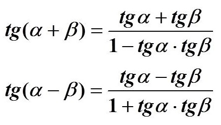
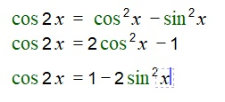
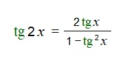

# Вопрос 16

### Формулы сложения. Формлы двойного угла.

В тригонометрии очень часто вычисления идут не с одним аргументом. Именно для этого есть множество формул. Например, формулы сложения и формулы двойного угла.

- Фомулы сложения для синуса

    

- Формулы сложения для косинуса

    

- Формулы сложения для тангенса 

    

> Важно! Формулы сложения для котангенса: Вспомнить, что ctg(x) = 1/tg(x)

#### Формулы двойного угла

- Формула двойного угла для синуса.

    

- Формулы двойного угла для косинуса.

    

- Формула двойного угла для тангенса.

    

> Важно! Формула двойного угла для котангенса: Вспомнить, что ctg(x) = 1/tg(x)
