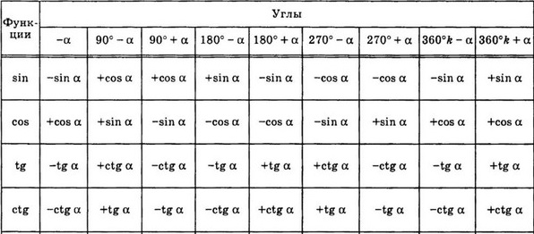

# Вопрос 17

### Формулы приведения. Правило. Примеры

Формулы приведения разработаны для углов, представленных в одном из следующих видов: 
π/2+a π/2+a, π/2−a π/2−a, π+a π+a, π−a π−a, 3π/2+a 3π/2+a, 3π/2−a 3π/2−a, 2π+a 2π+a и 2π−a 2π−a. Аналогично их можно использовать для углов представленных в градусах: 90∘+a 90°+a, 90∘− a 90°−a, 180∘+a 180°+a, 180∘−a 180°−a, 270∘+a 270°+a, 270∘−a 270°−a, 180∘+a 180°+a, 180∘−a 180°−a. К счастью, учить наизусть формулы привидения вам не придется, потому что есть легкий и надежный способ вывести нужную за пару секунд. 

Правило:
- Формулы приведения зависят от четверти, от знаков функций в этой четверти.
- Так же они зависят от аргумента, из которого мы вычитаем, или который мы прибавляем.
    1. Проанализировать аргумент
        1. Понять, в какую четверть попадает аргумент
        2. Определить знак выражения

    2. Если в аргументе есть п/2 или 3п/2..., то функция меняется на кофункцию.
    3. Собрать все вместе(знак и кофункцию)

    - Например:
        - sin(2130) = sin(360 * 6 - 30), где 360*6 = 12п
        - Значит, функция не меняется
        - Теперь: 360 * 6 - 30 - угол 4 четверти ==> знак минус
        - Т.е sin(360 * 6 - 30) = -sin(30) = -0,5
            * Ответ: -0,5

