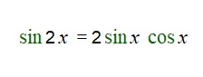
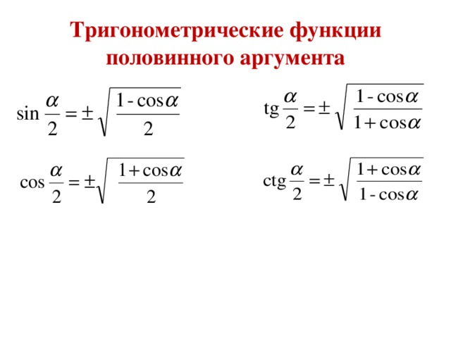

# Вопрос 18

### Формулы двойного и половинного угла. Формулы понижения степени.

- В тригонометрии, в частности в тригонометрических уравнениях, очень часто вычисления идут не с одним и тем же аргументом. Именно для этого существуют формулы двойного, половиннго угла, а так же формулы понижения степени.

- Формулы двойного угла.

    

    

    

- Формулы половинного угла. 
    - Выводятся из основго тригонометрического тождества.

        