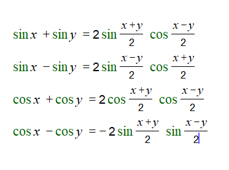
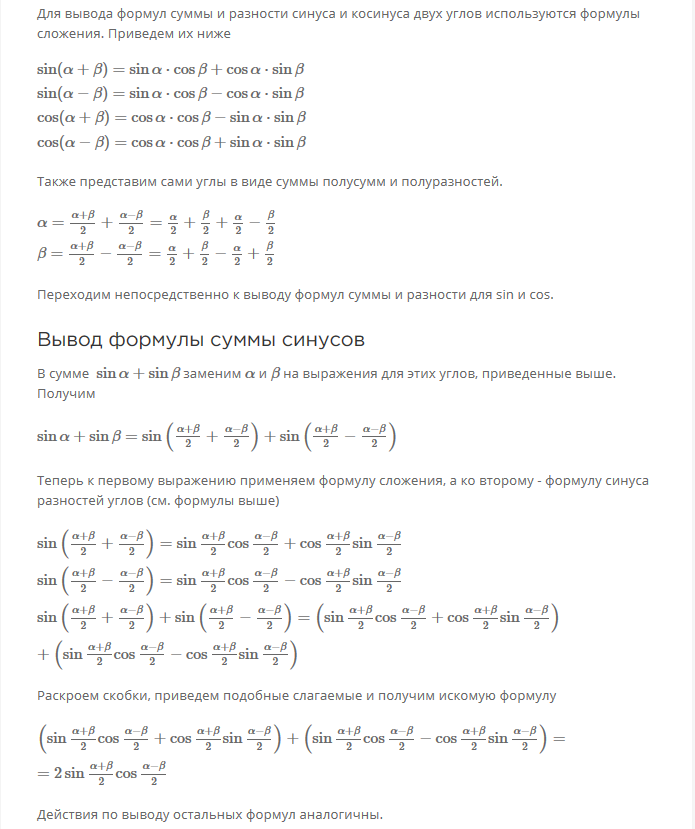
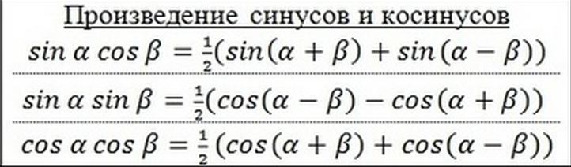

# Вопрос 19

### Формулы суммы и разности синусов и косинусов. Формулы преобразования произведения тригонометрических функций в сумму.

- Формулы суммы синусов и косинусов

    

    * Как выводить:
        * Например, 1 формула.
            

- Формулы произвеления 

    

    * Как выводить:
        * Например, 3 формула. 
            * Вспомнить формулы cos(x+y) и cos(x-y)
            * Сложить эти формулы 
            * Вынести 1/2(Чтобы избавиться от двоек в каждой из формул)
