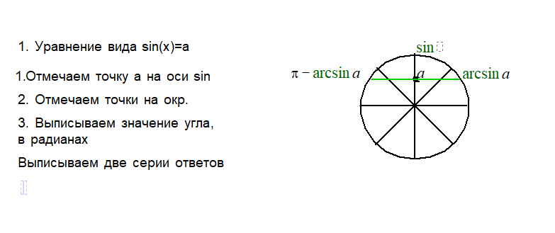
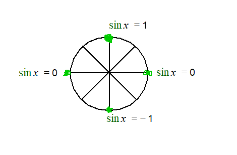
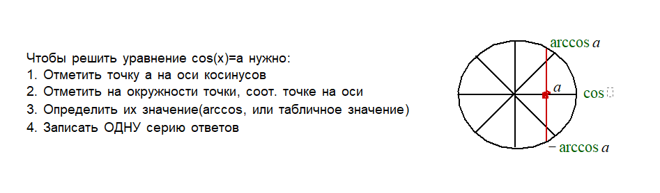
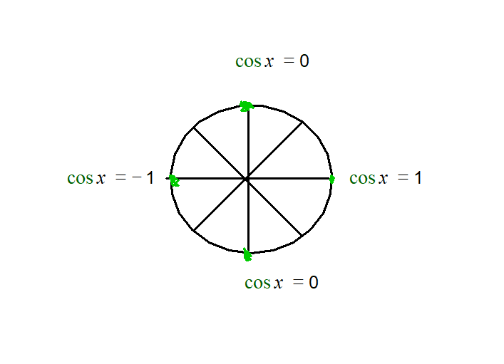
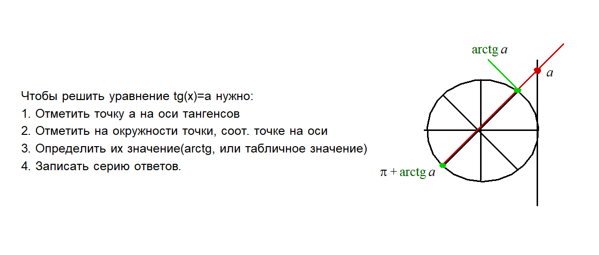
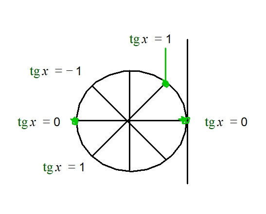
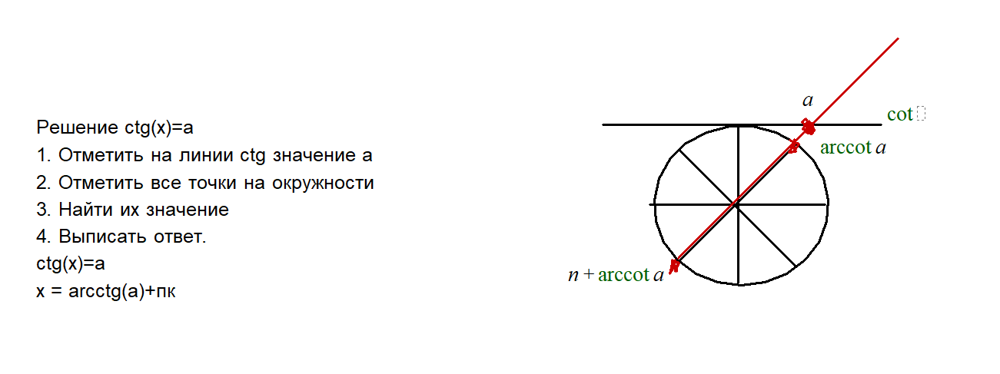
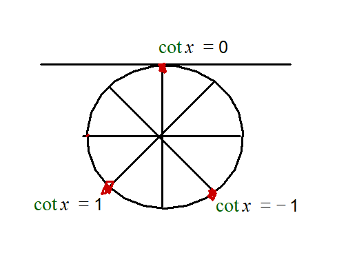

# Вопрос 20

### Решение простейших тригонометрических уравнений. Частные случаи.

- Алгоритм решения простейших уравнение. 
    * Найти точку на оси функции, соот. значению
    * Выделить точки, соот. значению на оси функции.
    * Выписать значения углов в радианах, соот. точкам на окружности.
    * Выписать серии ответов, учитывая период.

#### Решение уравнение sin(x)=a

> ***Арксинус***, это функция, обратная синусу. То есть, ее аргументом является значение синуса исходного угла, а возвращает она исходный угол

 - Важно! ***arcsin(b)*** - такое число a, где a[-п/2 ; п/2], а b[-1;1], что arcsin(b) = a.
 - ***arcsin(-b)= -arcsin(b)***

- Серии ответов выписываются с возможным периодом(+2пk, k - целое)
- Если значения точек на окружности известно, выписываем их радианную меру.

- Частные случаи:
    * Если sin(x) = 0
        * Синус равен нулю в двух точках на триг. окружности - 0, п
        * След эти точки можно записать в виде одной серии: пk, k - целое
        * Ответ: пk, k - целое

    * Если sin(x) = 1
        * Такому значению соот. только одна точка - 90 градусов(п/2)
        * След., ответ: п/2 + 2пк, к - целое (2п т.к нам нужно совершить полный оборот, чтобы вернуться в эту же точку)

    * Если sin(x) = -1
        * Аналогично sin(x) = 1, только вместо п/2 есть точка -п/2
        * Ответ: -п/2 + 2пк, к - целое

    

#### Решение уравнений типа cos(x)=a

***Арккосинус***, это функция, обратная косинусу. То есть, ее аргументом является значение косинуса исходного угла, а возвращает она исходный угол

> Важно! ***arccos(b)*** - такое число a, где a[0;п], а b[-1;1], что arccos(b) = a.
- ***arccos(-b) = п - arccos(b)***

- Серия ответов выписываются с возможным периодом(+2пk, k - целое)
- Если значения точек на окружности известно, выписываем их радианную меру.

- Частные случаи:
    * Если cos(x) = 0
        * Таких точек две: п/2 и 3п/2, и нам нужен полупериод, чтобы в них попасть
        * След., ответ: п/2 + пк, к - целое

    * Если cos(x) = 1
        * Только одна точка, в которую нужен полный оборот - 0
        * След. ответ: 2пк, к - целое

    * Если cos(x) = -1
        * Только одна точка с полным периодом.
        * Ответ: п + 2пк, к - целое

    

#### Решение уравнений типа tg(x)=a

***Арктангенс***, это функция, обратная тангенсу. То есть, ее аргументом является значение тангенса исходного угла, а возвращает она исходный угол.

> Важно! ***arctg(b)*** - такое число a, где a(-п/2;п/2), а b - любое, что arctg(b) = a.
- ***arctg(-b) = -arctg(b)***

- Частные случаи:
    * Если tg(x) = 0
        * Две точки - 0 + пк, к - целое
       
    * Если tg(x) = 1
        * Две точки - п/4 + пк, к - целое

    * Если tg(x) = -1
        * Две точки - -п/4 + пк, к - целое

    

#### Решение уравнений типа ctg(x)=a

***Арккотангенс***, это функция, обратная котангенсу. То есть, ее аргументом является значение котангенса исходного угла, а возвращает она исходный угол.

> Важно! ***arcctg(b)*** - такое число a, где a(0;п), а b - любое, что arcctg(b) = a.
- ***arcctg(-b) = п-arcctg(b)***

- Частные случаи:
    * Если ctg(x) = 0
        * Две точки - п/2 + пк, к - целое
       
    * Если ctg(x) = 1
        * Две точки - п/4 + пк, к - целое

    * Если tg(x) = -1
        * Две точки - -п/4 + пк, к - целое

     