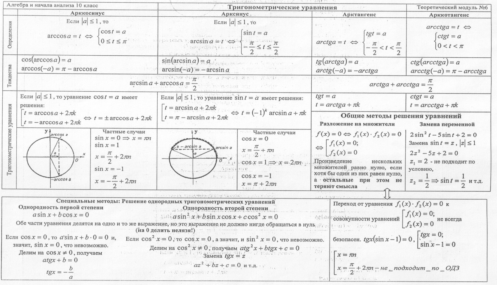

# Вопрос 21.

### Решение уравнений, их виды.

- Виды тригонометрических уравнений
    * Простейшие уравнения
        * ***sin(x) = a***
        * ***cos(x) = a***
        * ***tg(x)  = a***
        * ***ctg(x) = a***

    * Однородные уравнения первой степени:
        * ***a * sin(x) + b * cos(x) = 0***

    * Квадратные(сводимые к квадратным уравнения)
        * a * sin^2(x) + b * sin^2(x) = 0

    * Однородные уравнения второй степени:
        * a * sin^2(x) + b * sin(x) * cos(x) + c * cos^2(x) = 0

    * Неоднородные уравнения первой степени:
        * ***a * sin(x) + b * cos(x) = c***

- Так же существует еще один метод решения решения тригонометрических уравнений - метод **вспомогательного угла**

    