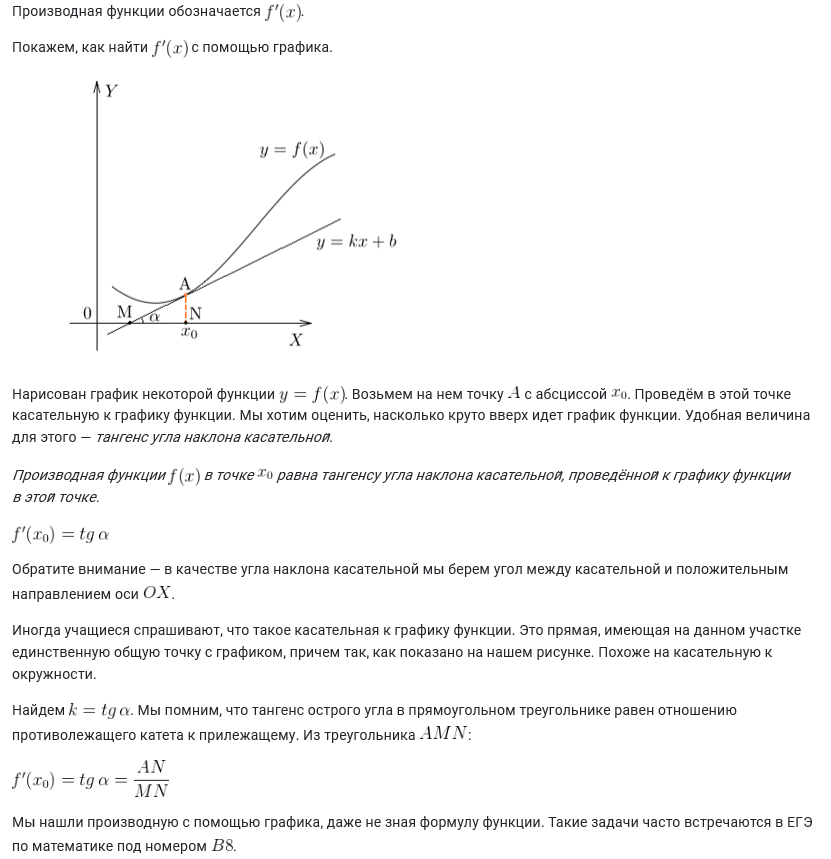
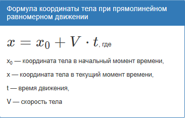

# Вопрос 22

### Определение производной, её механический и геометрический смыслы.

- ***Производная*** (функции в точке) — основное понятие дифференциального исчисления, которое характеризует скорость изменения функции

- Геометрический смысл производной:
    * Производная функции f(x~0~) в точке x~0~ равна тангенсу угла наклона касательной, проведённой к графику функции в этой точке.

    

***

- Механическкий смысл производной
- Физический смысл производной.
    * Если точка движется вдоль оси х и ее координата изменяется по закону  x(t), то мгновенная скорость точки: V(t) = x'(t); a(t) = V'(t)

        
